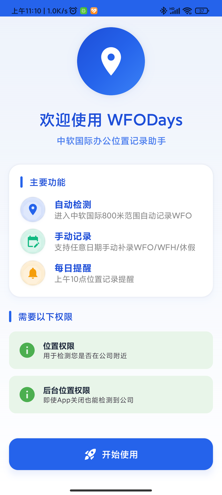
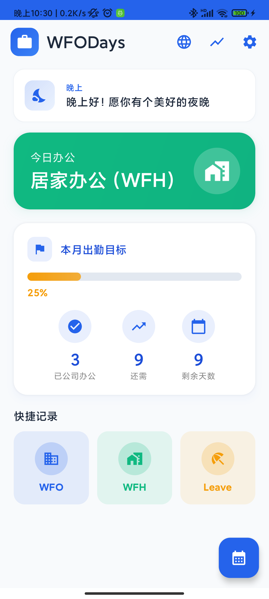
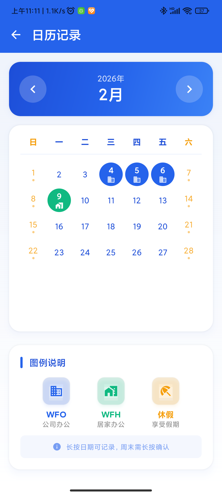
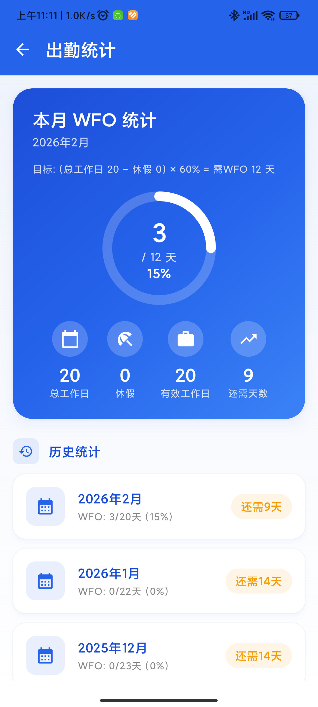
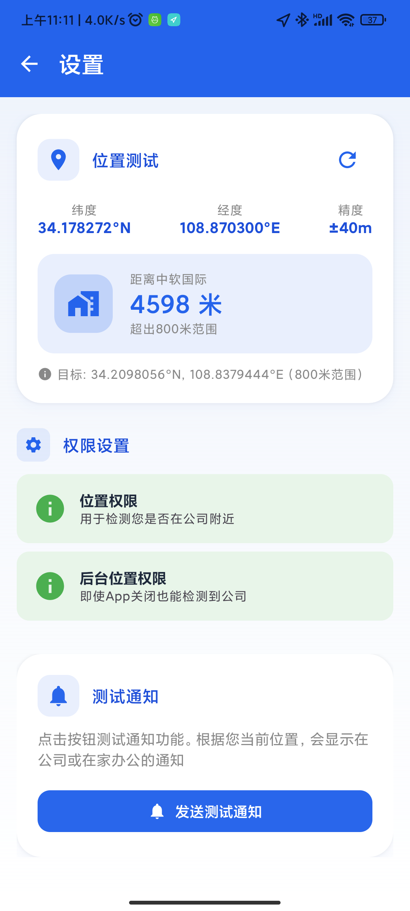

# WFODays - 办公位置记录助手

<p align="center">
  
</p>

<p align="center">
  <b>智能记录您的办公位置，轻松管理 WFO/WFH 出勤</b>
</p>

<p align="center">
  
  
  
  
</p>

---

## ✨ 功能特性

### 📍 智能位置检测
- **自动检测**：进入公司 800 米范围自动记录 WFO
- **原生 GPS**：支持原生 GPS 定位，无需 Google Play 服务
- **后台定位**：即使 App 关闭也能检测到公司位置

### 📝 灵活记录方式
- **自动记录**：基于位置自动判断 WFO/WFH
- **手动记录**：支持任意日期手动补录 WFO/WFH/LEAVE
- **长按切换**：长按今日状态卡片快速切换工作模式

### 📊 出勤统计
- **实时统计**：本月 WFO/WFH/休假天数实时统计
- **目标追踪**：自动计算 WFO 达标进度，达标百分比可在设置中自定义（默认 60%）
- **历史记录**：查看历史月份出勤统计

### 🔔 智能提醒
- **每日提醒**：上午自动检测并记录位置
- **通知推送**：位置更新时推送通知提醒

### ⚙️ 个性化设置
- **出勤率配置**：在设置页面通过滑块调整 WFO 目标百分比（1%-100%），所有达标计算、进度显示和目标公式将自动同步使用新值
- **多语言问候**：根据时段（早/中/下午/晚/凌晨/周末）和语言（中/英）随机展示问候语

---

## 🚀 快速开始

### 系统要求
- Android 9.0 (API 28) 或更高版本
- 位置权限（精确定位）
- 后台位置权限（可选，用于自动检测）

### 安装

#### 方式一：直接安装 APK
从 [Releases](../../releases) 页面下载最新版本的 APK 文件安装。

#### 方式二：自行编译
```bash
# 克隆仓库
git clone https://github.com/yourusername/wfodays.git
cd wfodays

# 编译 Debug 版本
./gradlew :app:assembleDebug

# 编译 Release 版本
./gradlew :app:assembleRelease
```

### 首次使用
1. 打开应用，授权位置权限
2. 应用会自动根据当前位置记录今日状态
3. 双击今日状态卡片可手动切换 WFO/WFH/休假

---

## 📱 应用截图

<p align="center">
  
  
  
  
  
</p>

---

## 🛠 技术栈

- **语言**: Kotlin 2.3
- **UI 框架**: Jetpack Compose 2.3
- **架构**: MVVM + Repository 模式
- **依赖注入**: Hilt
- **本地存储**: Room 数据库 + DataStore（用户偏好设置）
- **后台任务**: WorkManager
- **位置服务**: Android 原生 LocationManager

---

## 📁 项目结构

```
app/src/main/java/me/anyang/wfodays/
├── data/
│   ├── database/          # Room 数据库
│   ├── entity/            # 数据实体
│   ├── local/             # 本地数据源
│   └── repository/        # 数据仓库
├── location/              # 位置服务
│   ├── NativeLocationManager.kt
│   ├── DailyLocationCheckWorker.kt
│   └── GeofenceManager.kt
├── notification/          # 通知服务
├── ui/
│   ├── components/        # 可复用组件
│   ├── screens/           # 页面
│   ├── theme/             # 主题
│   └── viewmodel/         # ViewModel
└── utils/                 # 工具类
```

---

## ⚙️ 配置说明

### 公司位置配置
在 `Constants.kt` 中修改公司坐标：

```kotlin
companion object {
    const val OFFICE_LATITUDE = 34.211892
    const val OFFICE_LONGITUDE = 108.834240
    const val OFFICE_RADIUS_METERS = 800f
    const val OFFICE_NAME = "环普产业园"
}
```

### 出勤率配置
WFO 达标百分比默认为 60%，支持两种修改方式：

**方式一：应用内设置（推荐，运行时生效）**

进入「设置」→「出勤设置」→「WFO 出勤率」，通过滑块调整 1%-100% 之间的任意值。修改后所有达标计算、进度条、目标公式和达成提示会自动同步使用新值，无需重启应用。

**方式二：修改默认值（影响首次安装的初始值）**

在 `Constants.kt` 中修改默认百分比：

```kotlin
companion object {
    // 出勤率要求（默认百分比，用户可在设置中修改）
    const val DEFAULT_REQUIRED_ATTENDANCE_RATE_PERCENT = 60
}
```

### 通知时间配置
在 `DailyCheckScheduler.kt` 中修改每日检测时间：

```kotlin
// 设置为每天上午 10:30 执行
calendar.set(Calendar.HOUR_OF_DAY, 10)
calendar.set(Calendar.MINUTE, 30)
```

---

## 🤝 贡献指南

欢迎提交 Issue 和 Pull Request！

1. Fork 本仓库
2. 创建特性分支 (`git checkout -b feature/AmazingFeature`)
3. 提交更改 (`git commit -m 'Add some AmazingFeature'`)
4. 推送到分支 (`git push origin feature/AmazingFeature`)
5. 创建 Pull Request

---

## 📄 开源协议

本项目基于 [MIT](LICENSE) 协议开源。

---

## 👨‍💻 作者

**Stephen Y An**

---

## 🙏 致谢

- [Jetpack Compose](https://developer.android.com/jetpack/compose) - 现代 Android UI 工具包
- [Hilt](https://dagger.dev/hilt/) - 依赖注入框架
- [Room](https://developer.android.com/training/data-storage/room) - 本地数据库
- [WorkManager](https://developer.android.com/topic/libraries/architecture/workmanager) - 后台任务调度

---

<p align="center">
  <b>⭐ 如果这个项目对你有帮助，请给它一个 Star！</b>
</p>
